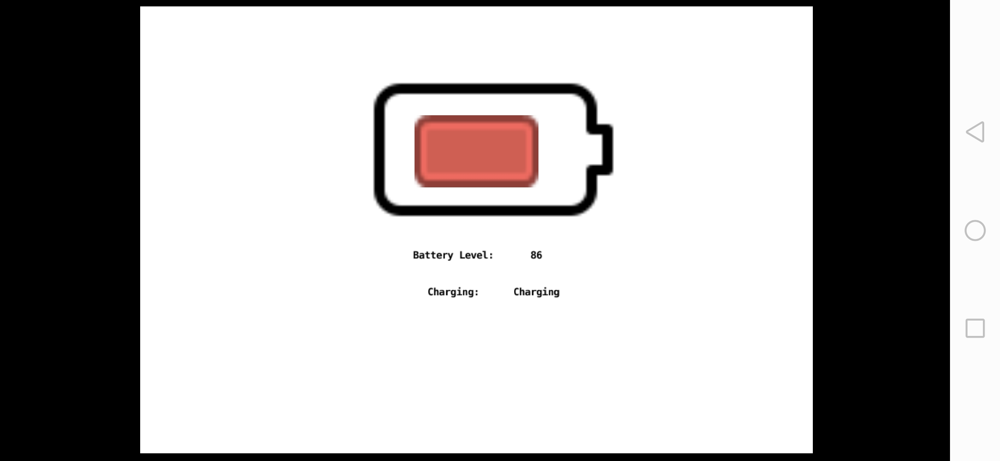

# Defold Battery Status Extension for Android
This extension exposes 2 functions on Defold that allow you to check for:

* Charge %
* If the device is charging or not charging

The repo comes with a sample GUI that shows you charge % and charging status.

## Exposed functions

* `battery.percentage()` - Integer value of the percentage of charge
* `battery.is_charging()` - Boolean status of whether charging or not

You can use these 2 functions in your lua code.

## Screen shot

